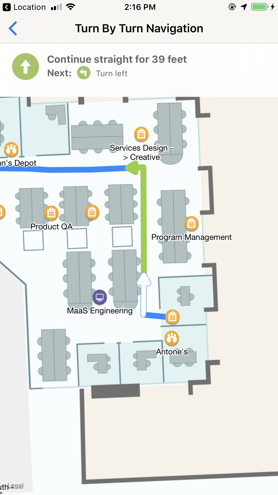

Turn-By-Turn Navigation
====================

### Featur Detail
- Display turn-by-turn route instruction card on top of map.
- Swipe turn-by-turn card to select a route instruction.

### Resource 
- **TurnByTurnViewController.swift** - The display view controller
- **TurnByTurnInstructionCollectionViewCell.swift/xib** - Turn-by-turn card
- **DirectionImages.xcassets** - Direction icons display on the turn-by-turn card

### Demo Sample
- Fill out `applicationId`, `accessKey`, `signatureKey`, and `buildingIdentifier` in **TurnByTurnViewController.swift**. You can ignore it if you have already filled out in the **ScenarioSelectViewController.swift**.
- Fill out `startPOIIdentifier` and `destinationPOIIdentifier` in **TurnByTurnViewController.swift**.
- Run the app in your device or iOS simulator.

### Integrate To Your Application
- Add the following files to your project
	* TurnByTurnViewController.swift
	* TurnByTurnInstructionCollectionViewCell.swift/xib
	* DirectionImages.xcassets
- Build a way in your application to start TurnByTurnViewController.swift.

### Customization
- Customize the icons on the turn-by-turn card.
	* **Option 1**: Replace the icons in the `DirectionImages.xcassets` with yours.
	* **Option 2**: Or reimplement `private func imageFromDirection(_ direction: PWRouteInstructionDirection) -> UIImage` method in `TurnByTurnInstructionCollectionViewCell.swift` to make it return your icons.
- Redesign the turn-by-turn card.
	* Edit `TurnByTurnInstructionCollectionViewCell.xib` with interface builder.

# Privacy
You understand and consent to Phunware’s Privacy Policy located at www.phunware.com/privacy. If your use of Phunware’s software requires a Privacy Policy of your own, you also agree to include the terms of Phunware’s Privacy Policy in your Privacy Policy to your end users.

# Terms
Use of this software requires review and acceptance of our terms and conditions for developer use located at http://www.phunware.com/terms/
